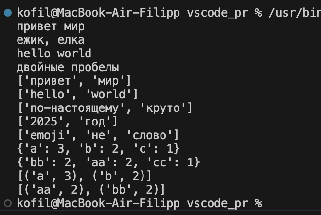
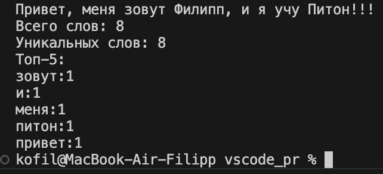

# Лабороторная работа 3

# Задание A
## normalize

```python
def normalize(text: str, *, casefold: bool = True, yo2e: bool = True) -> str:
    result = text
    
    if casefold:
        result = result.casefold()    
    if yo2e:
        result = result.replace('ё', 'е').replace('Ё', 'е')
    
    for char in ['\t', '\r', '\n']:
        result = result.replace(char, ' ')
    
    result = re.sub(r'\s+', ' ', result).strip()
    return result
```
## tokenize

```python
def tokenize(text: str) -> List[str]:
    pattern = r'\w+(?:-\w+)*'
    tokens = re.findall(pattern, text)
    return tokens
```
## count_freq

```python
def count_freq(tokens: List[str]) -> Dict[str, int]:
    frequency_dict = {}
    for token in tokens:
        frequency_dict[token] = frequency_dict.get(token, 0) + 1
    return frequency_dict
```

## top_N

```python
def top_n(freq: Dict[str, int], n: int = 5) -> List[Tuple[str, int]]:
    items = list(freq.items())
    sorted_items = sorted(items, key=lambda x: (-x[1], x[0]))
    return sorted_items[:n]
```

## Тест-кейсы

```python
print(normalize("ПрИвЕт\nМИр\t"))
print(normalize("ёжик, Ёлка"))
print(normalize("Hello\r\nWorld"))
print(normalize("  двойные   пробелы  "))

print(tokenize("привет мир"))
print(tokenize("hello,world!!!"))
print(tokenize("по-настоящему круто"))
print(tokenize("2025 год"))
print(tokenize("emoji 😀 не слово"))

print(count_freq(["a", "b", "a", "c", "b", "a"]))
print(count_freq(["bb", "aa", "bb", "aa", "cc"]))

freq0 = {"a": 3, "b": 2, "c": 1}
print(top_n(freq0, 2))
freq1 = {"bb": 2, "aa": 2, "cc": 1}
print(top_n(freq1, 2))
```

## Вывод


# Задание B

```python
import sys
import os

sys.path.append(os.path.join(os.path.dirname(__file__), '..'))

from lib.text import normalize, tokenize, count_freq, top_n

def main():
    text = input()
    
    if not text.strip():
        raise ValueError('Нет текста :(')
    
    normalized_text = normalize(text, casefold=True, yo2e=True)
    tokens = tokenize(normalized_text)
    total_words = len(tokens)
    unique_words = len(set(tokens))
    freq = count_freq(tokens)
    top_words = top_n(freq, 5)
    
    print(f"Всего слов: {total_words}")
    print(f"Уникальных слов: {unique_words}")
    print("Топ-5:")
    for word, count in top_words:
        print(f"{word}:{count}")

if __name__ == "__main__":
    main()
```
## Вывод


# Общий вывод

В лабораторной №3 разработан текстовый анализатор с четырьмя основными функциями: нормализация, токенизация, подсчет частот и вывод топ-N слов. Программа text_stats.py анализирует ввод пользователя и показывает общую статистику: total слов, unique слов и 5 самых частых слов. Все модули протестированы и готовы к интеграции в будущие проекты.