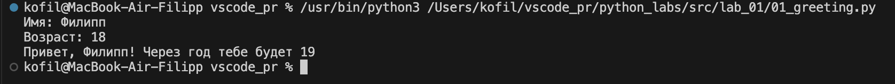
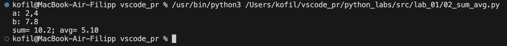
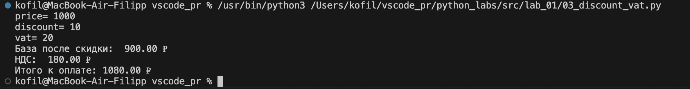
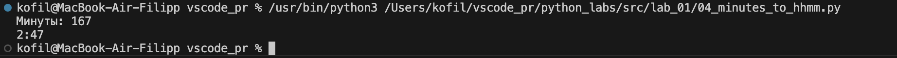
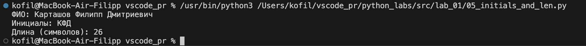

# ЛР1

## Задание 1

```python
name = input("Имя: ")
age = int(input('Возраст: '))

print(f'Привет, {name}! Через год тебе будет {age+1}')
```


## Задание 2

```python
a = float(input('a: ').replace(',', '.'))
b = float(input('b: ').replace(',', '.'))

print(f'sum= {a+b}; avg= {(a+b)/2:.2f}')
```


## Задание 3

```python
price = float(input("price= "))
discount = float(input("discount= "))
vat = float(input("vat= "))

base = price * (1 - discount/100)
vat_amount = base * (vat/100)
total = base + vat_amount

print(f"База после скидки:  {base:.2f} ₽")
print(f"НДС:  {vat_amount:.2f} ₽")
print(f"Итого к оплате: {total:.2f} ₽")   
```


## Задание 4

```python
m = int(input("Минуты: "))

hours = m // 60 
minutes = m % 60

print(f"{hours}:{minutes}")  
```


## Задание 5

```python
fio = input("ФИО: ")

initials = "".join([word[0] for word in fio.split()])
length = len(fio)

print(f"Инициалы: {initials}")
print(f"Длина (символов): {length}")
```

