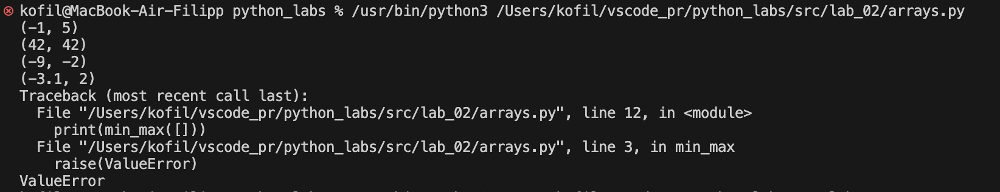

# ЛР2

## Задание 1

```python
def min_max(nums):
    if not nums:
        raise(ValueError)
    else:
        mini = min(nums)
        maxi = max(nums)
        return (mini, maxi)
print(min_max([3, -1, 5, 5, 0]))
print(min_max([42]))
print(min_max([-5, -2, -9]))
print(min_max([1.5,2,2.0,-3.1]))
print(min_max([]))
```


## Задание 2

```python
def unique_sorted(numbers):
    return (list(sorted(set(numbers))))
print(unique_sorted([3, 1, 2, 1, 3]))
print(unique_sorted([]))
print(unique_sorted([-1, -1, 0, 2, 2]))
print(unique_sorted([1.0, 1, 2.5, 2.5, 0]))
```


## Задание 3

```python
def flatten(mat):
    flat_list = []
    for row in mat:
        if isinstance(row, (list, tuple)):
            flat_list.extend(row)
        else:
            raise(TypeError)
    return (flat_list)
print(flatten([[1, 2], [3, 4]]))
print(flatten([[1, 2], (3, 4, 5)]))
print(flatten([[1], [],[2, 3]]))
print(flatten([[1, 2], "ab"]))
```


## Задание 4

```python
def transpose(mat):
    if not mat:
        return []
    
    rows = len(mat)
    cols = len(mat[0])
    
    for row in mat:
        if len(row) != cols:
            raise(ValueError)
    
    result = []
    
    for j in range(cols):
        new_row = []
        for i in range(rows):
            new_row.append(mat[i][j])
        result.append(new_row)
    
    return result

print(transpose([[1, 2, 3]]))
print(transpose([[1], [2], [3]]))
print(transpose([[1, 2], [3, 4]]))
print(transpose([]))
print(transpose([[1, 2], [3]]))
```


## Задание 5

```python
def row_sums(mat):
    if not mat:
        return []    
    rows = len(mat)
    cols = len(mat[0])

    for row in mat:
        if len(row) != cols:
            raise(ValueError)        
    sums = []
    for row in mat:          
        total = sum(row)      
        sums.append(total)    
    return sums
print(row_sums([[1,2,3], [4,5,6]]))
print(row_sums([[-1, 1], [10, -10]]))
print(row_sums([[0,0], [0,0]]))
print(row_sums([[1, 2], [3]]))
```


## Задание 6

```python
def col_sums(mat):
    if not mat:
        return []
    rows = len(mat)
    cols = len(mat[0])
    for row in mat:
        if len(row) != cols:
            raise(ValueError)    
    sums = []
    for j in range(cols):
        column_sum = 0
        for i in range(rows):
            column_sum += mat[i][j]
        sums.append(column_sum)    
    return sums

print(col_sums([[1, 2, 3], [4, 5, 6]]))  
print(col_sums([[-1, 1], [10, -10]]))    
print(col_sums([[0, 0], [0, 0]]))        
print(col_sums([[1, 2], [3]]))  
```
 