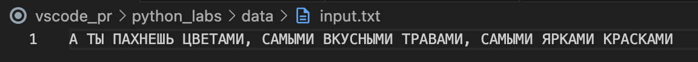
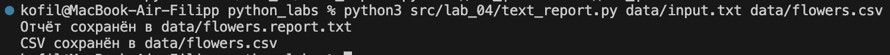
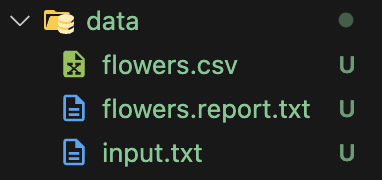
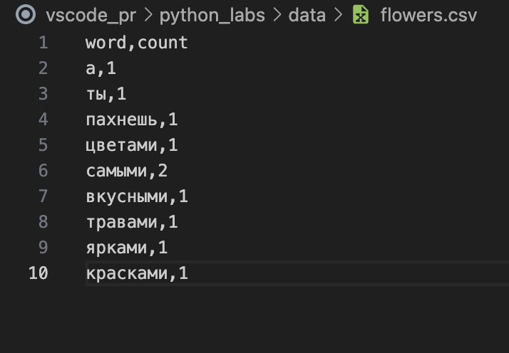
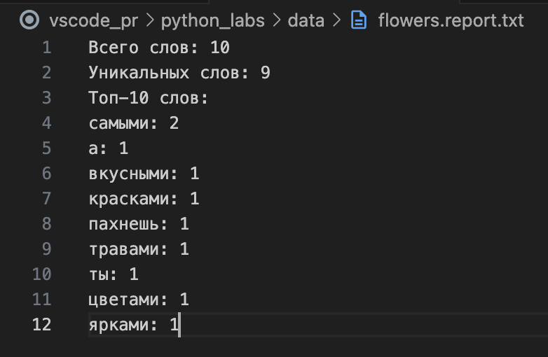

# Лабороторная работа 4

## src/lab04/io_txt_csv.py

```python
import csv
from pathlib import Path
from typing import Dict, List, Tuple


def read_text(path: Path) -> str:
    """Читает текст из .txt файла."""
    with open(path, "r", encoding="utf-8") as f:
        return f.read()


def write_csv(path: Path, rows: List[Tuple[str, int]]) -> None:
    """Записывает частоты слов в CSV."""
    with open(path, "w", encoding="utf-8", newline="") as f:
        writer = csv.writer(f)
        writer.writerow(["word", "count"])
        writer.writerows(rows)
```
# Задание B
## src/lab04/text_report.py

```python
import sys
import os
from pathlib import Path

# Добавляем src в sys.path
sys.path.append(os.path.join(os.path.dirname(__file__), ".."))

# Импорт из предыдущей лабы
from lib.text import normalize, tokenize, count_freq, top_n

# Импорт из io_txt_csv.py
from lab_04.io_txt_csv import read_text, write_csv


def main():
    if len(sys.argv) < 3:
        print("Использование: python3 src/lab_04/text_report.py <входной_файл> <выходной_файл.csv>")
        sys.exit(1)

    input_path = Path(sys.argv[1])
    output_path = Path(sys.argv[2])

    # 1. Читаем текст
    text = read_text(input_path)

    # 2. Обрабатываем (из лабы 3)
    norm_text = normalize(text)
    tokens = tokenize(norm_text)
    freq = count_freq(tokens)

    # 3. Статистика
    total = len(tokens)
    unique = len(set(tokens))
    top = top_n(freq, 10)

    # 4. Запись CSV
    write_csv(output_path, list(freq.items()))

    # 5. Создаём отчёт (txt)
    report_path = output_path.with_suffix(".report.txt")
    with open(report_path, "w", encoding="utf-8") as f:
        f.write(f"Всего слов: {total}\n")
        f.write(f"Уникальных слов: {unique}\n")
        f.write("Топ-10 слов:\n")
        for word, count in top:
            f.write(f"{word}: {count}\n")

    print(f"Отчёт сохранён в {report_path}")
    print(f"CSV сохранён в {output_path}")


if __name__ == "__main__":
    main()
```

### Для работы программы нам необходимо запустить ее и в терминале написать "python3 src/lab_04/text_report.py <входной_файл> <выходной_файл.csv>", где <входной_файл> - это текстовый документ, куда написан необходимый для обработки текст, а <выходной_файл.csv> - csv-файл. Входной файл должен быть изначально добавлен в папку data, а выходной файл будет создан автоматически в той же папке.

# Пример
## Изначальный текстовый файл.


## Введение комманд и вывод программы.


## Папка data сразу после работы программы.


## Внутри csv-файла.


## Внутри txt-файла.


