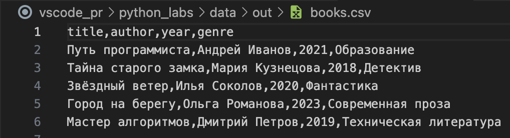

# Лабороторная работа 5

# Задание А src/lab05/json_csv.py

```python
import sys
import os
sys.path.append(os.path.join(os.path.dirname(__file__), ".."))

from pathlib import Path
import json
import csv


def json_to_csv(json_path: str, csv_path: str) -> None:
    json_path = Path(json_path)
    csv_path = Path(csv_path)

    if not json_path.exists():
        raise FileNotFoundError(f"Файл не найден: {json_path}")

    with open(json_path, "r", encoding="utf-8") as f:
        try:
            data = json.load(f)
        except json.JSONDecodeError:
            raise ValueError("Некорректный JSON-файл")

    if not isinstance(data, list) or not data:
        raise ValueError()

    # Сбор всех возможных ключей (чтобы заполнить пропуски пустыми строками)
    all_keys = set()
    for item in data:
        if not isinstance(item, dict):
            raise ValueError()
        all_keys.update(item.keys())

    # Порядок колонок — как в первом объекте, затем остальные по алфавиту
    first_keys = list(data[0].keys())
    remaining_keys = sorted(all_keys - set(first_keys))
    headers = first_keys + remaining_keys

    with open(csv_path, "w", encoding="utf-8", newline="") as f:
        writer = csv.DictWriter(f, fieldnames=headers)
        writer.writeheader()
        for item in data:
            row = {key: item.get(key, "") for key in headers}
            writer.writerow(row)


def csv_to_json(csv_path: str, json_path: str) -> None:
    csv_path = Path(csv_path)
    json_path = Path(json_path)

    if not csv_path.exists():
        raise FileNotFoundError(f"Файл не найден: {csv_path}")

    with open(csv_path, "r", encoding="utf-8") as f:
        reader = csv.DictReader(f)
        if not reader.fieldnames:
            raise ValueError("CSV не содержит заголовок")

        data = list(reader)
        if not data:
            raise ValueError("CSV пуст")

    with open(json_path, "w", encoding="utf-8") as f:
        json.dump(data, f, ensure_ascii=False, indent=2)


if __name__ == "__main__":
    if len(sys.argv) < 3:
        print("Использование: python3 src/lab_05/json_csv.py <режим> <input_file>")
        print("Режимы: json2csv, csv2json")
        sys.exit(1)

    mode = sys.argv[1].lower()
    input_file = sys.argv[2]
    
    # Определяем базовую директорию относительно расположения скрипта
    base = Path(__file__).resolve().parent.parent.parent
    out_dir = base / "data" / "out"
    out_dir.mkdir(parents=True, exist_ok=True)

    input_path = Path(input_file)
    
    if mode == "json2csv":
        output_file = out_dir / f"{input_path.stem}.csv"
        json_to_csv(input_file, output_file)
        print(f"Создан: {output_file}")
        
    elif mode == "csv2json":
        output_file = out_dir / f"{input_path.stem}.json"
        csv_to_json(input_file, output_file)
        print(f"Создан: {output_file}")
        
    else:
        print("Неизвестный режим. Используйте: json2csv или csv2json")
```
### Для работа программы нужно ввести команду "python3 src/lab_05/json_csv.py <режим> <input_file>". 
## Доступные режимы:
### json2csv - режим, который делает из JSON-файла CSV-файл.
### csv2json - режим, который делает из CSV-файла JSON-файл.

## Примеры работы программы (для каждого преобразования бралось по два файла):

## JSON→CSV
### Изначальные файлы (people.json и books.json) в папке samples:


### Команды в терминале (во избежание большого количества скриншотов, буду показывать только на одном файле):


### CSV-файлы появились в папке data/out/





## CSV→JSON
### Изначальные файлы (people.csv и fruits.csv):


### Команды в терминале:


### JSON-файлы появились в папке data/out/


# Задание B src/lab05/csv_xlsx.py

```python
import sys
import os

sys.path.append(os.path.join(os.path.dirname(__file__), ".."))

import csv
from pathlib import Path
from openpyxl import Workbook


def csv_to_xlsx(csv_path: Path, xlsx_path: Path) -> None:
    """
    Конвертирует CSV-файл в XLSX (Excel).
    """
    wb = Workbook()
    ws = wb.active
    ws.title = "Data"

    with open(csv_path, "r", encoding="utf-8") as f:
        reader = csv.reader(f)
        for row in reader:
            ws.append(row)

    wb.save(xlsx_path)


if __name__ == "__main__":
    if len(sys.argv) < 3:
        print("Использование: python3 src/lab_05/csv_to_xlsx.py <режим> <input_file>")
        print("Режимы: csv2xlsx")
        sys.exit(1)

    mode = sys.argv[1].lower()
    input_file = sys.argv[2]

    base = Path(__file__).resolve().parent.parent.parent
    out_dir = base / "data" / "out"
    out_dir.mkdir(parents=True, exist_ok=True)

    input_path = Path(input_file)

    if mode == "csv2xlsx":
        output_file = out_dir / f"{input_path.stem}.xlsx"
        csv_to_xlsx(input_file, output_file)
        print(f"Создан: {output_file}")

    else:
        print("Неизвестный режим. Используйте: csv2xlsx")
```
### Для данного задания была задействована библеотека openpyxl, которая была скачена через текст "openpyxl==3.1.5" в файле requirements.txt, а также в терминале была использованна команда "pip3 install -r requirements.txt". Для работы программы нужно ввести команду "python3 src/lab_05/csv_to_xlsx.py <режим> <input_file>"
## Доступные режимы:
### csv2xlsx - режим, который делает из CSV-файла XLSX-файл.

## Примеры работы программы 

## CSV→XLSX
### Изначальные файлы (cities.csv и ID.csv) в папке samples:


### Команды в терминале:


### XLSX-файлы появились в папке data/out/


### Файлы в Excel:


# Вывод: 
### В ходе лабораторной работы была реализована программа для конвертации файлов между форматами CSV, XLSX и JSON с использованием языка Python и библиотек openpyxl. В результате программа представляет собой гибкий инструмент для преобразования данных между тремя широко распространенными форматами, что закрепляет понимание их структуры и принципов работы с ними.