# Лабораторная работа 6: CLI‑утилиты с argparse

## Реализованные CLI‑утилиты

- Модуль `src/lab06/cli_text.py` с подкомандами:
  - `stats --input <txt> [--top 5]` — анализ частот слов в тексте;
  - `cat --input <path> [-n]` — вывод содержимого файла построчно (с нумерацией при `-n`).

- Модуль `src/lab06/cli_convert.py` с подкомандами:
  - `json2csv --in data/samples/people.json --out data/out/people.csv`  
  - `csv2json --in data/samples/people.csv --out data/out/people.json`  
  - `csv2xlsx --in data/samples/people.csv --out data/out/people.xlsx`

  ## Результаты выполнения

### cli_text

### код:
```python
import argparse
import sys
import os
from pathlib import Path

# Добавляем путь к src, чтобы импортировать lib/text.py
sys.path.append(os.path.join(os.path.dirname(__file__), ".."))
from lib.text import normalize, tokenize, count_freq, top_n


def main(argv=None):
    if argv is None:
        argv = sys.argv[1:]

    parser = argparse.ArgumentParser(
        description="CLI-утилита для работы с текстом (cat, stats)"
    )
    subparsers = parser.add_subparsers(dest="command")

    # подкоманда cat
    cat_parser = subparsers.add_parser(
        "cat",
        help="Вывести содержимое файла",
        description="Вывести содержимое текстового файла построчно.",
    )
    cat_parser.add_argument(
        "--input",
        required=True,
        help="Путь к файлу",
    )
    cat_parser.add_argument(
        "-n",
        dest="number",
        action="store_true",
        help="Нумеровать строки",
    )

    # подкоманда stats
    stats_parser = subparsers.add_parser(
        "stats",
        help="Показать топ-N слов",
        description="Показать топ-N самых частых слов в файле.",
    )
    stats_parser.add_argument(
        "--input",
        required=True,
        help="Путь к файлу",
    )
    stats_parser.add_argument(
        "--top",
        type=int,
        default=5,
        help="Сколько слов вывести (по умолчанию 5)",
    )

    args = parser.parse_args(argv)

    if not args.command:
        parser.print_help()
        return

    try:
        if args.command == "cat":
            file_path = Path(args.input)

            if not file_path.is_file():
                print(f"Ошибка: файл '{file_path}' не найден.", file=sys.stderr)
                raise FileNotFoundError(file_path)

            with file_path.open("r", encoding="utf-8") as f:
                for num, line in enumerate(f, start=1):
                    line = line.rstrip("\n")
                    if args.number:
                        print(f"{num:>2}. {line}")
                    else:
                        print(line)

        elif args.command == "stats":
            file_path = Path(args.input)

            if not file_path.is_file():
                print(f"Ошибка: файл '{file_path}' не найден.", file=sys.stderr)
                raise FileNotFoundError(file_path)

            text = file_path.read_text(encoding="utf-8")

            if not text.strip():
                print("Файл пуст — статистику не посчитать.", file=sys.stderr)
                return

            normalized = normalize(text, casefold=True, yo2e=True)
            tokens = tokenize(normalized)
            freq = count_freq(tokens)
            top_words = top_n(freq, args.top)

            print(f"Топ-{args.top} слов в файле '{args.input}':")

            max_len = max(len(word) for word, _ in top_words)
            for word, count in top_words:
                print(f"{word.ljust(max_len)}   {count}")

        else:
            parser.print_help()

    except FileNotFoundError:
        sys.exit(1)


if __name__ == "__main__":
    main()

```
  - **cat**

  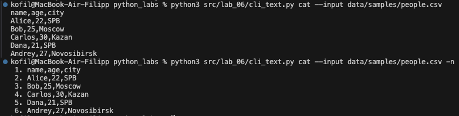
  - **stats**

  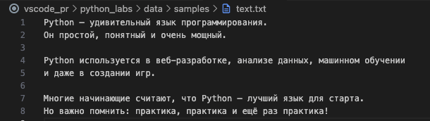
  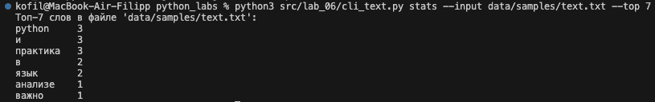
  - **help**

  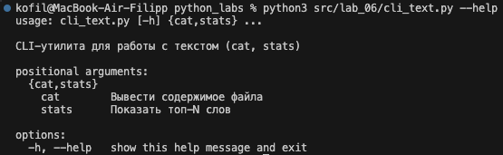

### cli_convert

### код:
```python
import argparse
from pathlib import Path
import sys
import os

# путь к src, чтобы импортировать функции из lab05
sys.path.append(os.path.join(os.path.dirname(__file__), ".."))

from lab_05.json_csv import json_to_csv, csv_to_json
from lab_05.csv_to_xlsx import csv_to_xlsx


def build_parser() -> argparse.ArgumentParser:
    parser = argparse.ArgumentParser(
        description="Конвертеры данных (JSON <-> CSV <-> XLSX)"
    )

    subparsers = parser.add_subparsers(
        dest="command",
        title="Команды",
        description="Доступные подкоманды: json2csv, csv2json, csv2xlsx",
        metavar="команда",
    )

    # json2csv
    p1 = subparsers.add_parser(
        "json2csv",
        help="Конвертация JSON → CSV",
        description="Конвертация данных из JSON-файла в CSV-файл.",
    )
    p1.add_argument(
        "--in",
        "--input",
        dest="input",
        required=True,
        help="Входной JSON-файл",
        metavar="ПУТЬ",
    )
    p1.add_argument(
        "--out",
        "--output",
        dest="output",
        required=True,
        help="Выходной CSV-файл",
        metavar="ПУТЬ",
    )
    p1.set_defaults(func=lambda args: json_to_csv(args.input, args.output))

    # csv2json
    p2 = subparsers.add_parser(
        "csv2json",
        help="Конвертация CSV → JSON",
        description="Конвертация данных из CSV-файла в JSON-файл.",
    )
    p2.add_argument(
        "--in",
        "--input",
        dest="input",
        required=True,
        help="Входной CSV-файл",
        metavar="ПУТЬ",
    )
    p2.add_argument(
        "--out",
        "--output",
        dest="output",
        required=True,
        help="Выходной JSON-файл",
        metavar="ПУТЬ",
    )
    p2.set_defaults(func=lambda args: csv_to_json(args.input, args.output))

    # csv2xlsx
    p3 = subparsers.add_parser(
        "csv2xlsx",
        help="Конвертация CSV → XLSX",
        description="Конвертация данных из CSV-файла в XLSX (Excel).",
    )
    p3.add_argument(
        "--in",
        "--input",
        dest="input",
        required=True,
        help="Входной CSV-файл",
        metavar="ПУТЬ",
    )
    p3.add_argument(
        "--out",
        "--output",
        dest="output",
        required=True,
        help="Выходной XLSX-файл",
        metavar="ПУТЬ",
    )
    p3.set_defaults(func=lambda args: csv_to_xlsx(args.input, args.output))

    return parser


def main(argv=None):
    if argv is None:
        argv = sys.argv[1:]

    parser = build_parser()
    args = parser.parse_args(argv)

    # Если подкоманда не указана — показать общий help
    if args.command is None:
        parser.print_help()
        sys.exit(1)

    try:
        # вызываем функцию, привязанную к подкоманде
        args.func(args)
        print(f"Создан файл: {args.output}")
    except FileNotFoundError as e:
        print(f"Ошибка: файл не найден ({e})", file=sys.stderr)
        sys.exit(1)


if __name__ == "__main__":
    main()

```
  - **json2csv**

  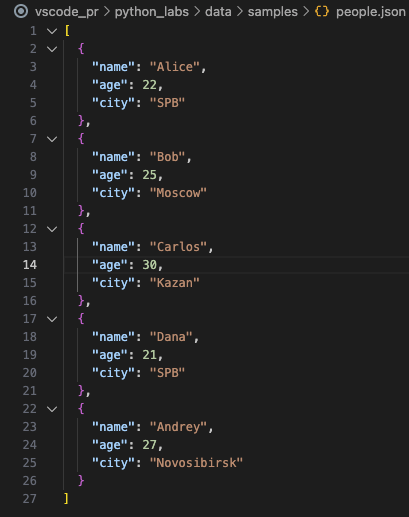
  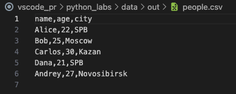

  - **csv2json**
  
  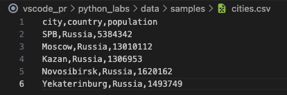
  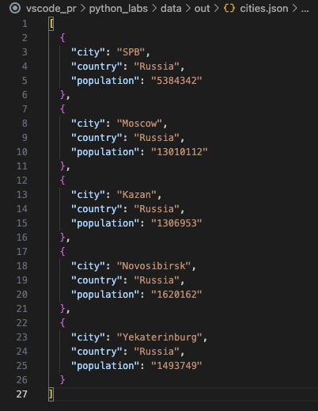

  - **csv2xlsx**

  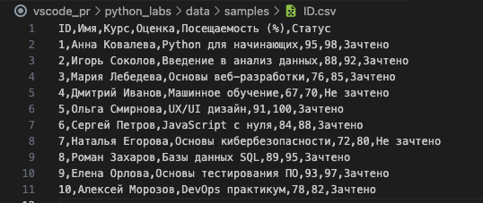
  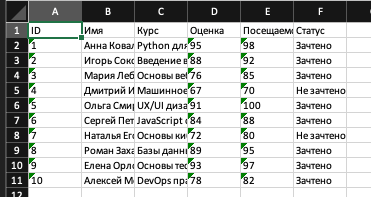
  
  - **help**

  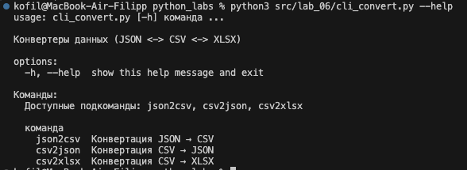

### CLI-модуль `cli_text.py`

#### Подкоманда `cat`
Выводит содержимое файла построчно с опциональной нумерацией строк.

**Синтаксис:**
```bash
python3 src/lab_06/cli_text.py cat --input <путь_к_файлу> [-n]
```

**Параметры:**
- `--input` (обязательный) - путь к файлу для чтения
- `-n` (опциональный) - включить нумерацию строк

**Примеры использования:**
```bash
# Простой вывод файла
python3 src/lab06/cli_text.py cat --input data/lab06/samples/people.csv

# Вывод с нумерацией строк
python3 src/lab06/cli_text.py cat --input data/lab06/samples/people.csv -n
```

**Особенности реализации:**
- Автоматическое определение кодировки файла (UTF-8)
- Обработка ошибок чтения файла
- Корректное отображение содержимого без лишних символов

#### Подкоманда `stats`
Анализирует частоты слов в текстовом файле и выводит топ-N самых частых слов.

**Синтаксис:**
```bash
python3 src/lab_06/cli_text.py stats --input <путь_к_файлу> [--top N]
```

**Параметры:**
- `--input` (обязательный) - путь к файлу для анализа
- `--top` (опциональный, по умолчанию 5) - количество топ-слов для вывода

**Примеры использования:**
```bash
# Анализ с топ-5 словами (по умолчанию)
python3 src/lab_06/cli_text.py stats --input data/lab_06/samples/text.txt

# Анализ с топ-7 словами
python3 src/lab_06/cli_text.py stats --input data/lab_06/samples/text.txt --top 7
```

**Особенности реализации:**
- Использует функции из библиотеки `lib.text` для нормализации и токенизации
- Автоматическая нормализация текста (приведение к нижнему регистру, удаление знаков препинания)
- Красивый табличный вывод результатов
- Обработка ошибок файлового ввода-вывода

### CLI-модуль `cli_convert.py`

#### Подкоманда `json2csv`
Конвертирует JSON-файл в CSV формат.

**Синтаксис:**
```bash
python3 src/lab_06/cli_convert.py json2csv --input <входной_json> --output <выходной_csv>
```

**Параметры:**
- `--input` (обязательный) - путь к входному JSON файлу
- `--output` (обязательный) - путь к выходному CSV файлу

**Пример:**
```bash
python3 src/lab_06/cli_convert.py json2csv --input data/lab_06/samples/people.json --output data/lab_06/out/people.csv
```

#### Подкоманда `csv2json`
Конвертирует CSV-файл в JSON формат.

**Синтаксис:**
```bash
python3 src/lab_06/cli_convert.py csv2json --input <входной_csv> --output <выходной_json>
```

**Параметры:**
- `--input` (обязательный) - путь к входному CSV файлу
- `--out` (обязательный) - путь к выходному JSON файлу

**Пример:**
```bash
python3 src/lab_06/cli_convert.py csv2json --input data/lab_06/samples/cities.csv --output data/lab_06/out/cities.json
```

#### Подкоманда `csv2xlsx`
Конвертирует CSV-файл в XLSX формат.

**Синтаксис:**
```bash
python3 src/lab_06/cli_convert.py csv2xlsx --input <входной_csv> --output <выходной_xlsx>
```

**Параметры:**
- `--input` (обязательный) - путь к входному CSV файлу
- `--output` (обязательный) - путь к выходному XLSX файлу

**Пример:**
```bash
python3 src/lab_06/cli_convert.py csv2xlsx --input data/lab_06/samples/ID.csv --out data/lab_06/out/ID.xlsx
```

**Особенности реализации:**
- Переиспользование функций конвертации из ЛР №5
- Автоматическое создание выходных директорий
- Валидация входных и выходных путей
- Обработка ошибок конвертации

### Справка по командам

Для получения справки по любой команде используйте флаг `-h` или `--help`:

```bash
# Общая справка по модулю
python3 src/lab06/cli_text.py --help
python3 src/lab06/cli_convert.py --help

# Справка по конкретной подкоманде
python3 src/lab06/cli_text.py cat --help
python3 src/lab06/cli_text.py stats --help
python3 src/lab06/cli_convert.py json2csv --help
```