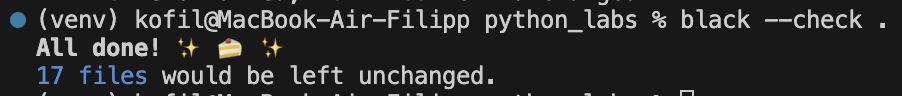
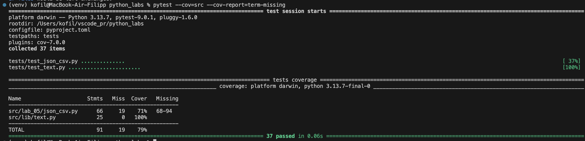
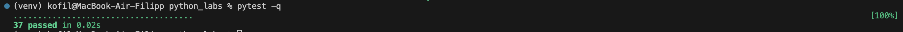

# ЛР7 — Тестирование: pytest + black + покрытие  
*(эффективная брокколи edition)*

## 📌 Краткое описание работы

В этой лабораторной работе я:

- написал автоматические тесты на `pytest` для модулей:
  - `src/lib/text.py`  
  - `src/lab_05/json_csv.py`
- проверил стиль проекта через `black`
- измерил покрытие кода (`pytest-cov`)
- оформил проект в модульную структуру
- подготовил отчёт со скриншотами

---

## 📁 Структура репозитория

```text
python_labs/
├─ pyproject.toml
├─ src/
│  ├─ lib/
│  │  └─ text.py
│  ├─ lab_05/
│  │  └─ json_csv.py
│  └─ lab_07/
│     └─ README.md   ← этот отчёт
├─ tests/
│  ├─ test_text.py
│  └─ test_json_csv.py
└─ venv/
```

---

# 🧪 Тестирование `src/lib/text.py`

## 🔧 Тестируемые функции

- `normalize(text)`
- `tokenize(text)`
- `count_freq(tokens)`
- `top_n(freq, n)`

## 📄 Мой файл tests/test_text.py

```python
import pytest
import sys
import os

sys.path.insert(0, os.path.abspath(os.path.join(os.path.dirname(__file__), "..")))
from src.lib.text import normalize, tokenize, count_freq, top_n


@pytest.mark.parametrize(
    "source, expected",
    [
        ("ПрИвЕт\nМИр\t", "привет мир"),
        ("ёжик, Ёлка", "ежик, елка"),
        ("Hello\r\nWorld", "hello world"),
        ("  двойные   пробелы  ", "двойные пробелы"),
        ("", ""),
        ("\t\n   ", ""),
    ],
)
def test_normalize_basic(source, expected):
    assert normalize(source) == expected


def test_normalize_no_casefold_no_yo2e():
    """Параметры casefold / yo2e должны реально влиять на результат."""
    text = "ЁЖик Мир"

    assert normalize(text, casefold=False, yo2e=False) == "ЁЖик Мир"

    assert normalize(text, casefold=False, yo2e=True) == "еЖик Мир"

    assert normalize(text, casefold=True, yo2e=False) == "ёжик мир"


@pytest.mark.parametrize(
    "source, expected",
    [
        ("привет мир", ["привет", "мир"]),
        ("один, два, три!", ["один", "два", "три"]),
        (
            "привет мир, привет-привет!",
            ["привет", "мир", "привет-привет"],
        ),
        ("", []),
        ("   много   пробелов   ", ["много", "пробелов"]),
        ("слово слово слово", ["слово", "слово", "слово"]),
        ("по-настоящему круто", ["по-настоящему", "круто"]),
        ("2025 год", ["2025", "год"]),
    ],
)
def test_tokenize(source, expected):
    assert tokenize(source) == expected


@pytest.mark.parametrize(
    "tokens, expected",
    [
        (["a", "b", "a", "c", "b", "a"], {"a": 3, "b": 2, "c": 1}),
        ([], {}),
        (["x"], {"x": 1}),
    ],
)
def test_count_freq(tokens, expected):
    assert count_freq(tokens) == expected


@pytest.mark.parametrize(
    "freq_dict, expected",
    [
        ({"a": 3, "b": 2, "c": 1}, [("a", 3), ("b", 2), ("c", 1)]),
        (
            {"яблоко": 2, "апельсин": 2, "банан": 2},
            [("апельсин", 2), ("банан", 2), ("яблоко", 2)],
        ),
        ({}, []),
        (
            {"a": 5, "b": 4, "c": 3, "d": 2, "e": 1, "f": 1},
            [("a", 5), ("b", 4), ("c", 3), ("d", 2), ("e", 1)],
        ),
    ],
)
def test_top_n_default(freq_dict, expected):
    assert top_n(freq_dict) == expected


def test_top_n_custom_n_and_bounds():
    freq = {"a": 3, "b": 2, "c": 1}

    assert top_n(freq, n=2) == [("a", 3), ("b", 2)]
    assert top_n(freq, n=0) == []
    assert top_n(freq, n=10) == [("a", 3), ("b", 2), ("c", 1)]

```

---

# 🧪 Тестирование `src/lab_05/json_csv.py`

## 🔧 Тестируемые функции

- `json_to_csv`
- `csv_to_json`

## 📄 Мой файл tests/test_json_csv.py

```python
import json
import csv
from pathlib import Path
import pytest
import sys
import os

sys.path.insert(0, os.path.abspath(os.path.join(os.path.dirname(__file__), "..")))
from src.lab_05.json_csv import json_to_csv, csv_to_json


def test_json_to_csv_roundtrip(tmp_path: Path):
    """Успешная конвертация JSON -> CSV."""
    src = tmp_path / "people.json"
    dst = tmp_path / "people.csv"

    data = [
        {"name": "Alice", "age": 22},
        {"name": "Bob", "age": 25},
    ]
    src.write_text(json.dumps(data, ensure_ascii=False), encoding="utf-8")

    json_to_csv(str(src), str(dst))

    with dst.open(encoding="utf-8") as f:
        rows = list(csv.DictReader(f))

    assert len(rows) == 2
    assert rows[0] == {"name": "Alice", "age": "22"}
    assert rows[1] == {"name": "Bob", "age": "25"}


def test_json_to_csv_missing_keys_and_header_order(tmp_path: Path):
    """
    Ключи, которые есть только в некоторых объектах, должны появляться в заголовке,
    а пропуски заполняться пустой строкой.
    Порядок: сначала ключи первого объекта, затем остальные по алфавиту.
    """
    src = tmp_path / "data.json"
    dst = tmp_path / "data.csv"

    data = [
        {"id": 1, "name": "Alice"},
        {"id": 2, "name": "Bob", "age": 30},
    ]
    src.write_text(json.dumps(data, ensure_ascii=False), encoding="utf-8")

    json_to_csv(str(src), str(dst))

    with dst.open(encoding="utf-8") as f:
        rows = list(csv.DictReader(f))

    assert list(rows[0].keys()) == ["id", "name", "age"]
    assert rows == [
        {"id": "1", "name": "Alice", "age": ""},
        {"id": "2", "name": "Bob", "age": "30"},
    ]


@pytest.mark.parametrize(
    "content",
    [
        "not a json",  # вообще не JSON
        "42",  # JSON-число, а не список
        "null",  # null
        "{}",  # объект, не список
        "[]",  # пустой список
        json.dumps([1, 2, 3], ensure_ascii=False),  # элементы не dict
    ],
)
def test_json_to_csv_invalid_structure(tmp_path: Path, content: str):
    """Некорректный/неподходящий JSON -> ValueError."""
    src = tmp_path / "broken.json"
    dst = tmp_path / "output.csv"
    src.write_text(content, encoding="utf-8")

    with pytest.raises(ValueError):
        json_to_csv(str(src), str(dst))


def test_json_to_csv_missing_file():
    """Отсутствующий входной файл JSON -> FileNotFoundError."""
    with pytest.raises(FileNotFoundError):
        json_to_csv("no_such_file.json", "output.csv")


def test_csv_to_json_roundtrip(tmp_path: Path):
    """Успешная конвертация CSV -> JSON."""
    src = tmp_path / "people.csv"
    dst = tmp_path / "people.json"

    with src.open("w", encoding="utf-8", newline="") as f:
        writer = csv.DictWriter(f, fieldnames=["name", "age"])
        writer.writeheader()
        writer.writerow({"name": "Alice", "age": "22"})
        writer.writerow({"name": "Bob", "age": "25"})

    csv_to_json(str(src), str(dst))

    data = json.loads(dst.read_text(encoding="utf-8"))

    assert isinstance(data, list)
    assert len(data) == 2
    assert data[0] == {"name": "Alice", "age": "22"}
    assert data[1] == {"name": "Bob", "age": "25"}


def test_csv_to_json_no_header(tmp_path: Path):
    """CSV без заголовка -> ValueError('CSV не содержит заголовок')."""
    src = tmp_path / "data.csv"
    dst = tmp_path / "data.json"

    src.write_text("", encoding="utf-8")

    with pytest.raises(ValueError, match="CSV не содержит заголовок"):
        csv_to_json(str(src), str(dst))


def test_csv_to_json_empty_data(tmp_path: Path):
    """Заголовок есть, но строк нет -> ValueError('CSV пуст')."""
    src = tmp_path / "data.csv"
    dst = tmp_path / "data.json"

    with src.open("w", encoding="utf-8", newline="") as f:
        writer = csv.writer(f)
        writer.writerow(["name", "age"]) 

    with pytest.raises(ValueError, match="CSV пуст"):
        csv_to_json(str(src), str(dst))


def test_csv_to_json_missing_file():
    """Отсутствующий CSV-файл -> FileNotFoundError."""
    with pytest.raises(FileNotFoundError):
        csv_to_json("no_such_file.csv", "output.json")


def test_invalid_suffix_to_json(tmp_path: Path):
    """
    Файл не похож на нормальный CSV, но реализация воспринимает первую строку как
    заголовок, а так как больше строк нет — падает с 'CSV пуст'.
    """
    src = tmp_path / "input.txt"
    dst = tmp_path / "output.json"
    src.write_text("This is 100% json, trust me", encoding="utf-8")

    with pytest.raises(ValueError, match="CSV пуст"):
        csv_to_json(str(src), str(dst))
```

---

# 🧰 Проверка стиля (`black`)

## Команда автоформатирования:

```bash
black .
```

## Команда проверки стиля:

```bash
black --check .
```

### 📸 Скриншот успешной проверки стиля



---

# 📈 Покрытие кода (`pytest-cov`)

## Команда запуска покрытия:

```bash
pytest --cov=src --cov-report=term-missing
```

### 📸 Скриншот покрытия



---

# 🧪 Прогон всех тестов

## Команда запуска тестов:

```bash
pytest -q
```

### 📸 Скриншот успешного прогона тестов



---

# ⚙ Мой `pyproject.toml`

```toml
[tool.black]
line-length = 88
target-version = ["py311"]
exclude = """
/(
    \\.git
  | \\.mypy_cache
  | \\.pytest_cache
  | \\.venv
  | venv
  | build
  | dist
)/
"""

[tool.pytest.ini_options]
pythonpath = ["src"]
testpaths = ["tests"]

```

---

# 🌟 Вывод

- Все тесты проходят ✔  
- Стиль проверен (`black --check .`) ✔  
- Покрытие собрано (`pytest-cov`) ✔  
- Модули протестированы и оформлены ✔  