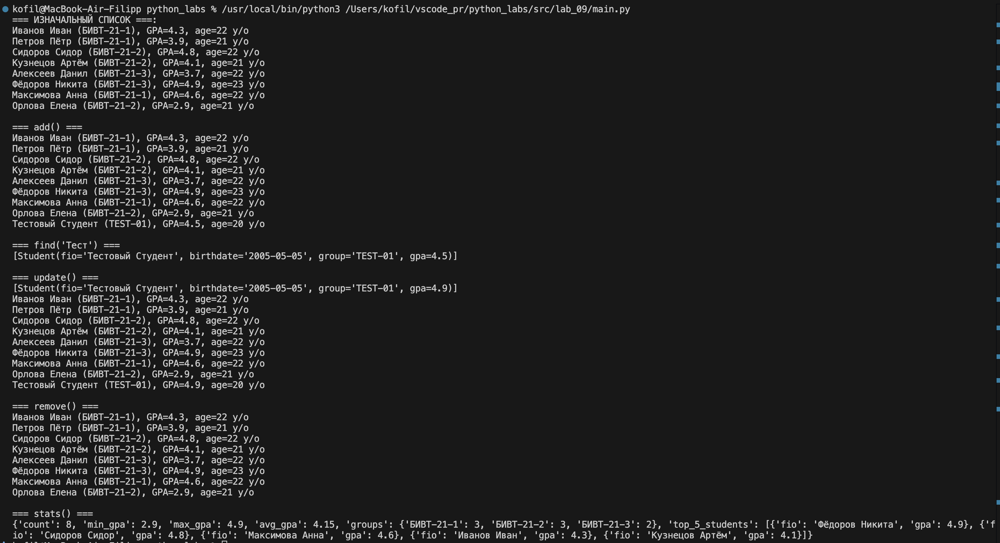

# Лабораторная работа 9
## «База данных» на CSV: класс Group, CRUD-операции и CLI

## group.py
```python
import os
import sys
import csv
from pathlib import Path
from typing import List

sys.path.append(os.path.abspath(os.path.join(os.path.dirname(__file__), '../lab_08')))
from models import Student


HEADER = ["fio", "birthdate", "group", "gpa"]


class Group:
    """
    CSV-based student storage with CRUD operations and analytics.
    """

    def __init__(self, storage_path: str):
        self.path = Path(storage_path)
        self._ensure_storage_exists()

    def _ensure_storage_exists(self) -> None:
        """Create CSV file with header if it does not exist."""
        if not self.path.exists():
            self.path.parent.mkdir(parents=True, exist_ok=True)
            with self.path.open("w", encoding="utf-8", newline="") as f:
                writer = csv.writer(f)
                writer.writerow(HEADER)

    def _read_all(self) -> List[Student]:
        """Load all rows from CSV → list[Student]."""
        students = []
        with self.path.open("r", encoding="utf-8", newline="") as f:
            reader = csv.DictReader(f)

            if reader.fieldnames != HEADER:
                raise ValueError(
                    f"Invalid CSV header. Expected {HEADER}, got {reader.fieldnames}"
                )

            for row in reader:
                try:
                    students.append(
                        Student(
                            fio=row["fio"],
                            birthdate=row["birthdate"],
                            group=row["group"],
                            gpa=float(row["gpa"]),
                        )
                    )
                except Exception as e:
                    raise ValueError(f"Invalid row in CSV: {row}") from e

        return students

    def _write_all(self, students: List[Student]) -> None:
        """Rewrite CSV file with the given student list."""
        with self.path.open("w", encoding="utf-8", newline="") as f:
            writer = csv.DictWriter(f, fieldnames=HEADER)
            writer.writeheader()
            for st in students:
                writer.writerow(
                    {
                        "fio": st.fio,
                        "birthdate": st.birthdate,
                        "group": st.group,
                        "gpa": st.gpa,
                    }
                )

    # CRUD OPERATIONS
    def list(self) -> List[Student]:
        """Return all students."""
        return self._read_all()

    def add(self, student: Student) -> None:
        """Add a new student (no duplicates by FIO)."""
        students = self._read_all()

        if any(st.fio == student.fio for st in students):
            raise ValueError(f"Student already exists: {student.fio}")

        students.append(student)
        self._write_all(students)

    def find(self, substr: str) -> List[Student]:
        """Find students whose FIO contains the given substring."""
        substr = substr.lower()
        return [st for st in self._read_all() if substr in st.fio.lower()]

    def remove(self, fio: str) -> None:
        """Delete the student with the exact FIO."""
        students = self._read_all()
        new = [st for st in students if st.fio != fio]

        if len(new) == len(students):
            raise ValueError(f"No student with fio: {fio}")

        self._write_all(new)

    def update(self, fio: str, **fields) -> None:
        """
        Update fields of an existing student.
        Example:
            group.update("Ivanov Ivan", gpa=4.9, group="SE-01")
        """
        students = self._read_all()
        updated = False

        for st in students:
            if st.fio == fio:
                for key, value in fields.items():
                    if not hasattr(st, key):
                        raise ValueError(f"Unknown field: {key}")
                    setattr(st, key, value)
                updated = True
                break

        if not updated:
            raise ValueError(f"No student with fio: {fio}")

        self._write_all(students)

    # ANALYTICS (★ optional)
    def stats(self) -> dict:
        """Return analytics: count, min/max/avg GPA, group distribution, top 5."""
        students = self._read_all()

        if not students:
            return {
                "count": 0,
                "min_gpa": None,
                "max_gpa": None,
                "avg_gpa": None,
                "groups": {},
                "top_5_students": [],
            }

        gpas = [st.gpa for st in students]

        # Group → count
        group_counts = {}
        for st in students:
            group_counts[st.group] = group_counts.get(st.group, 0) + 1

        # Top 5 by GPA
        top_5 = sorted(students, key=lambda s: s.gpa, reverse=True)[:5]

        return {
            "count": len(students),
            "min_gpa": min(gpas),
            "max_gpa": max(gpas),
            "avg_gpa": sum(gpas) / len(gpas),
            "groups": group_counts,
            "top_5_students": [{"fio": st.fio, "gpa": st.gpa} for st in top_5],
        }
```

## main.py
```python
from group import Group
from models import Student

g = Group("/Users/kofil/vscode_pr/python_labs/data/lab_09/students.csv")

print("=== ИЗНАЧАЛЬНЫЙ СПИСОК ===:")
print(*g.list(), sep="\n")

print("\n=== add() ===")
s = Student("Тестовый Студент", "2005-05-05", "TEST-01", 4.5)
g.add(s)
print(*g.list(), sep="\n")

print("\n=== find('Тест') ===")
print(g.find("Тест"))

print("\n=== update() ===")
g.update("Тестовый Студент", gpa="4.9")
print(g.find("Тест"))
print(*g.list(), sep="\n")

print("\n=== remove() ===")
g.remove("Тестовый Студент")
print(*g.list(), sep="\n")

print("\n=== stats() ===")
print(g.stats())
```


## students.csv
```csv
fio,birthdate,group,gpa
Иванов Иван,2003-10-10,БИВТ-21-1,4.3
Петров Пётр,2004-05-07,БИВТ-21-1,3.9
Сидоров Сидор,2003-01-01,БИВТ-21-2,4.8
Кузнецов Артём,2004-12-02,БИВТ-21-2,4.1
Алексеев Данил,2003-03-14,БИВТ-21-3,3.7
Фёдоров Никита,2002-08-10,БИВТ-21-3,4.9
Максимова Анна,2003-04-19,БИВТ-21-1,4.6
Орлова Елена,2004-07-21,БИВТ-21-2,2.9
```